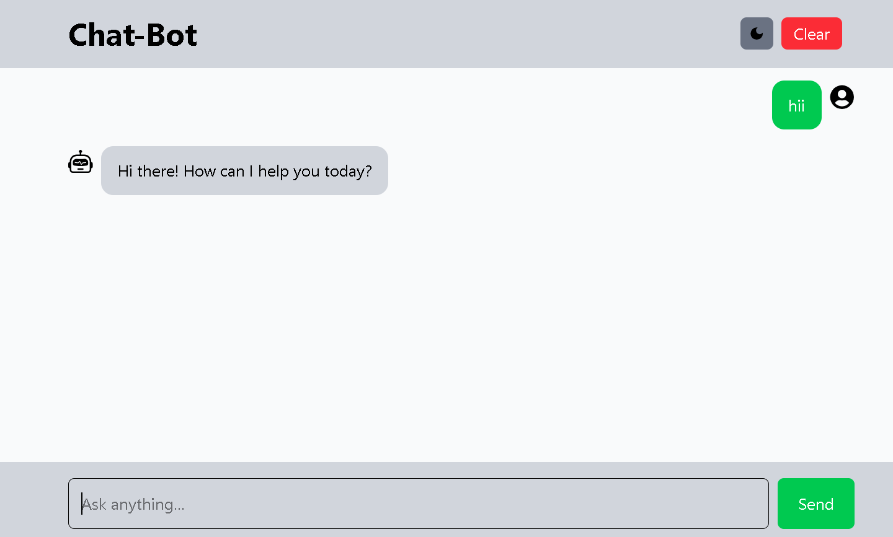

##🤖 ChatGPT Clone – AI Chatbot Project

A modern AI-powered chatbot web application inspired by ChatGPT.
Built using Next.js, React, and modern web technologies, this project provides a smooth and interactive conversational AI experience.

##🔗 Live Demo: 

https://chat-gpt-kappa-jade.vercel.app/

##📌 Features

- 💬 Real-time AI chat interface
- ⚡ Fast and responsive UI 
- 🌙 Dark/Light theme toggle 
- 🎨 Clean and modern design
- 🧠 AI-powered responses (ChatGPT-like experience)
- 📱 Fully responsive (mobile + desktop friendly)
- 🔄 Smooth chat flow with message history

##🛠️ Tech Stack

- Frontend:  React
- Styling: Tailwind CSS 
- API: Gemini API 
- Deployment: Vercel
- 🚀 Getting Started

- Follow these steps to run the project locally:

1. Clone the repository
- git clone https://github.com/your-username/chatbot-project.git
2. Install dependencies
- npm install
3. Run development server
- npm run dev
4. Open in browser
- http://localhost:3000

##📁 Project Structure

- /app or /pages → UI routes
- /components → Reusable components
- /lib → API / helper functions
- /styles → Styling files
- /public → Images & assets

##🔑 Environment Variables

Create a .env file:
- API_KEY=your_api_key_here

##📸 Screenshots

##🎯 Future Improvements

- Voice chat support 🎤
- Chat memory / history storage
- User authentication 🔐
- Better AI model tuning

##👨‍💻 Author

- Akash Gautam
- GitHub: [AkashGautam-27]
- Project: https://chat-gpt-kappa-jade.vercel.app/

##📄 License

- This project is licensed under the MIT License.

##👨‍💻 Developer

- Developed by Akash Gautam 🚀